<h1 align="center">Compose Playground</h1>

## Unit 1

- Greetings (Text, Image, Column, Box)
- ComposeArticle
- TaskManager (Project)
- ComposeQuadrant (Project: +Row)
- BusinessCard (Project)

  
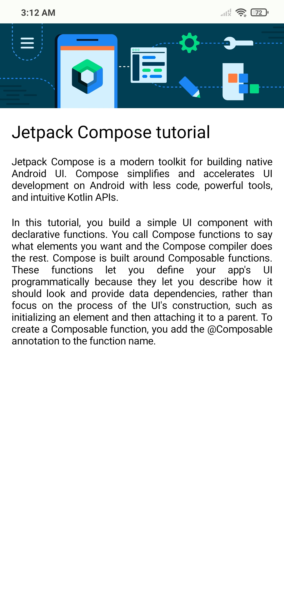
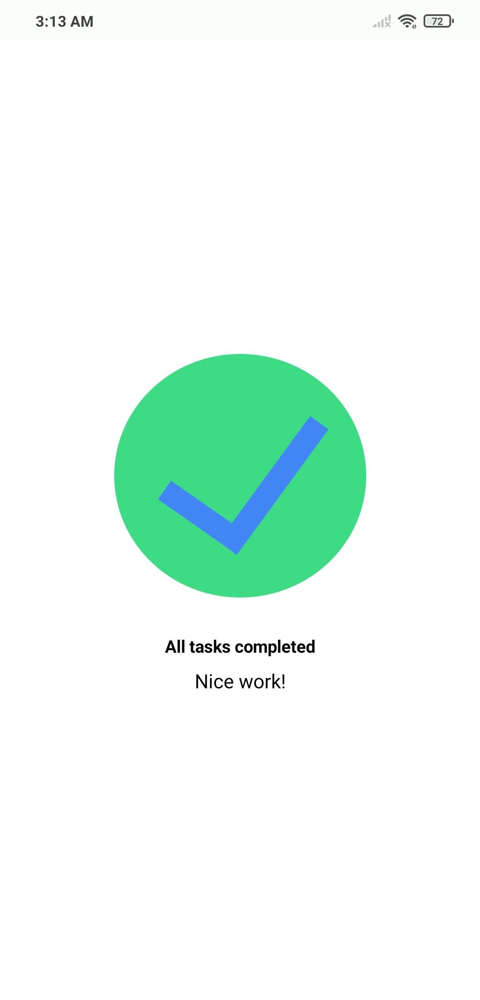
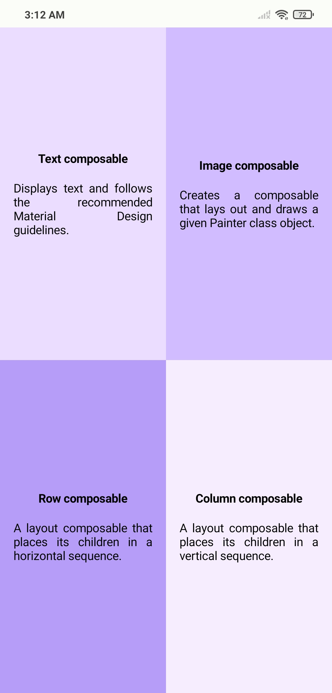
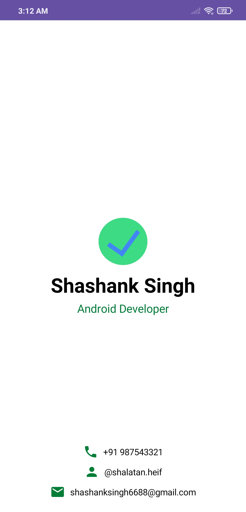

<h4>ComposeArticle | TaskManager | ComposeQuad | BusinessCard</h4>

## Unit 2

- DiceRoller (Buttons, remember, States)
- Lemonade (Project)
- TipCalculator (TextField, Switch, State Hoisting)
- ArtSpace (Project: +Surface)

  
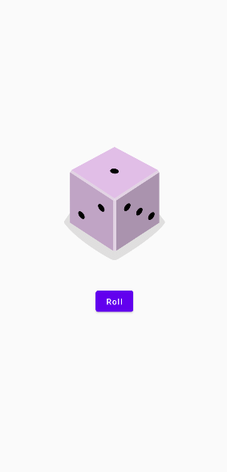
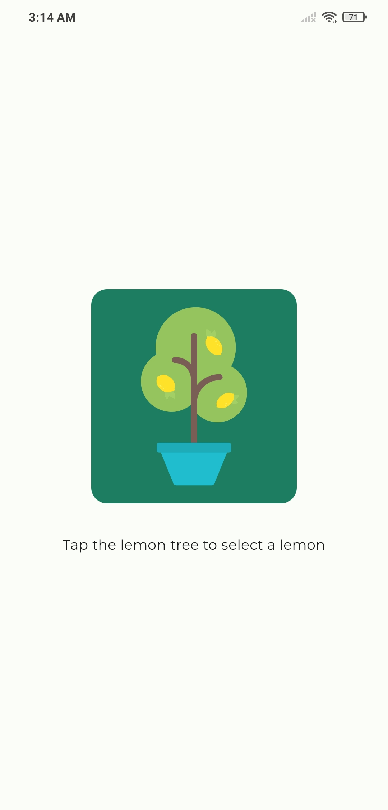
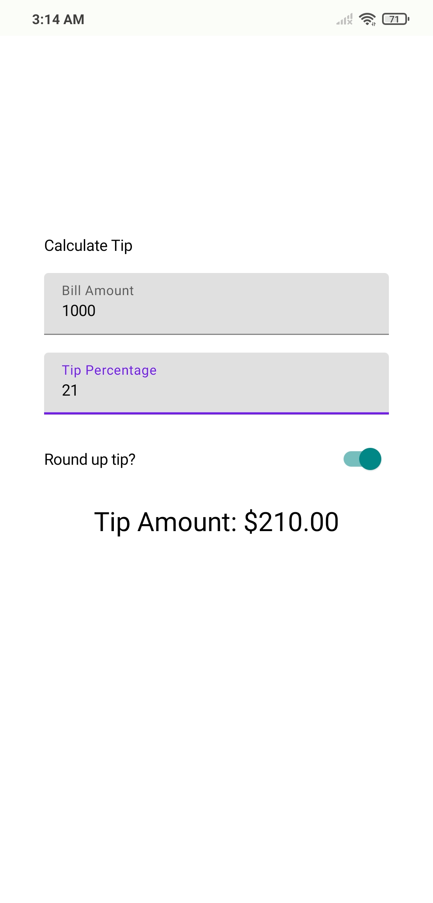
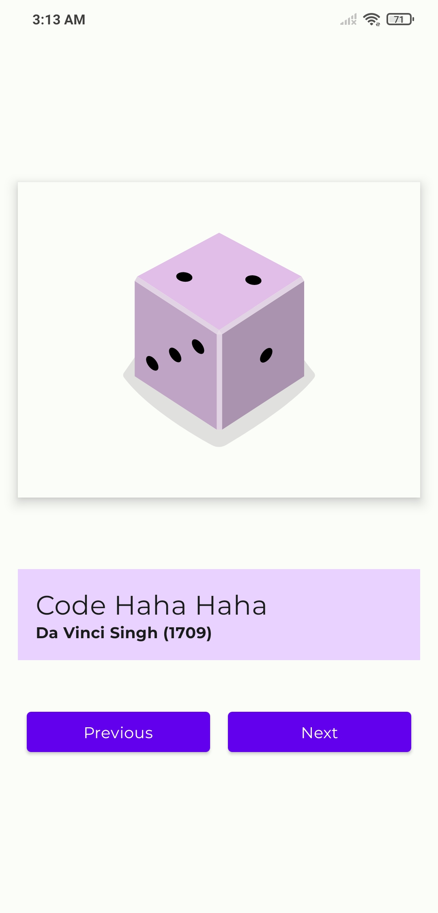

<h4>DiceRoller | LemondeApp | TipCalculator | ArtSpace</h4>

## Unit 3

- AffirmationsApp (LazyColumn, Card)
- TopicsApp (Project: LazyXGrid)
- WoofApp (Weight, Material Design: Theme, Shapes, Typography, Scaffold, MaterialIcons, Animation:
  animateXasState, animateContentSize)
- SuperheroesApp (Project)

  

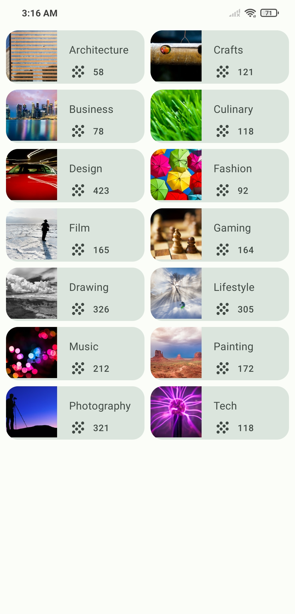
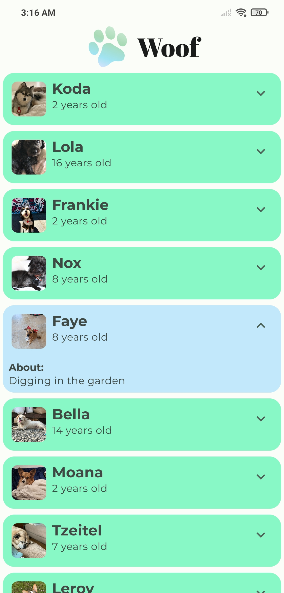
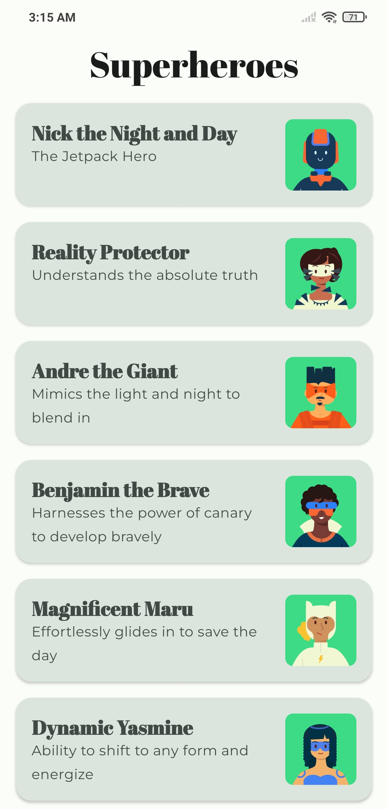l̥

<h4>Affirmations App | Topics App | Woof App | SuperheroesApp</h4>

## Unit 4

- UnsccrambleGame (StateFlow, ViewModel)
- DessertClicker (Project)
- CupCakeApp (Navigation Component, Navigate to other apps)

  
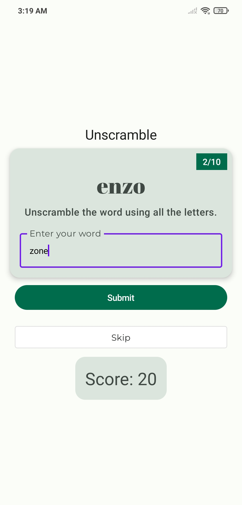
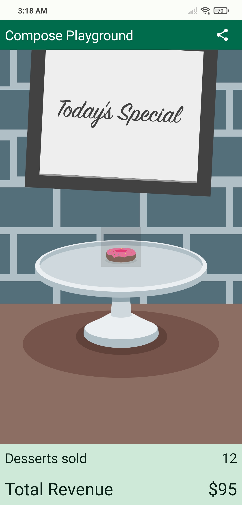

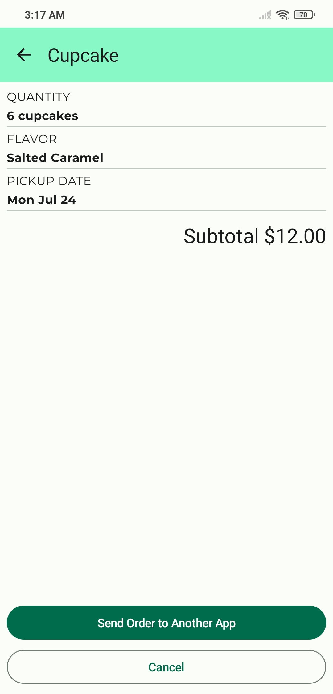l̥

<h4>Unscramble App | DessertClicker App | Cupcake App | Cupcake App</h4>